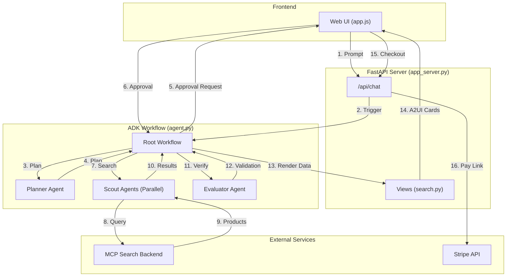

# Personalized Shopping Agent - "Shopping Squad"

A premium, persona-driven shopping concierge application powered by Gemini and built with the Retail Agent Development Suite (ADK) and A2UI (Server-Driven UI).

## 🌟 Features

### 🎭 Persona-Driven Experience
- **Tailored Scenarios**: Choose between different personas (Adam, Lucy, Elena), each with their own set of curated shopping scenarios.
- **Dynamic Routing**: The agent adapts its search and planning based on the active persona's preferences and budget.
- **Session Management**: Smooth transition between personas with a custom confirmation modal that protects your active session.

### 💎 Premium UI/UX
- **Glassmorphic Design**: A stunning, modern interface with rich gradients, glassmorphism (blur effects), and smooth transitions.
- **Intelligent Chat**: A clean conversational interface with smart follow-up actions.
- **Contextual Action Cards**: Product results are displayed in beautiful, actionable cards with direct "Add to Cart" capabilities.
- **Full-Width Follow-Up Menus**: At the end of a search, a full-width card presents natural follow-up options based on your persona.

### 🛒 Advanced Cart Management
- **Integrated Cart**: A side drawer cart that slides in and out, keeping your shopping flow uninterrupted.
- **Quantity Counter**: Easily see how many items you have selected.
- **Silent Actions**: Adding or removing items from the cart updates the UI smoothly without cluttering the chat history with system messages.
- **Stripe Checkout**: Ready-to-use integration for creating payment sessions via `/api/create-checkout-session`.

## 🛠️ Technology Stack

- **Backend**: Python, FastAPI / Starlette
- **Frontend**: Vanilla JavaScript, CSS3 (with advanced glassmorphism and CSS variables), Semantic HTML5
- **AI Integration**: Google Gen AI SDK (Gemini) via ADK
- **UI Framework**: A2UI (Server-Driven UI) for dynamic card rendering

## 🚀 Getting Started

### Prerequisites
- Python 3.10+
- Vertex AI Project 
- Stripe Secret Key (set as `STRIPE_SECRET_KEY` environment variable)

### Running the Application

#### Using `uv` (Recommended)

This project uses `uv` for dependency management.

1. Start the backend server:
   ```bash
   uv run python app_server.py
   ```

2. Open your browser and navigate to `http://localhost:8000` (or as configured).

#### Using Docker

You can also run the application in a Docker container.

1. Build the Docker image:
   ```bash
   docker build -t shopping-squad .
   ```

2. Run the container:
   ```bash
   docker run -p 8080:8080 \
     -e STRIPE_SECRET_KEY="your_stripe_secret_key" \
     -e GOOGLE_CLOUD_PROJECT="your_project_id" \
     shopping-squad
   ```

### ☁️ Deploying to Google Cloud Run

To deploy the application to Google Cloud Run:

1. Ensure you have the Google Cloud SDK installed and are authenticated.
2. Run the following command to deploy from source:
   ```bash
   gcloud run deploy shopping-squad \
     --source . \
     --region us-central1 \
     --allow-unauthenticated \
     --set-env-vars="GOOGLE_CLOUD_PROJECT=your_projectid,GOOGLE_CLOUD_LOCATION=your_location,GOOGLE_GENAI_USE_VERTEXAI=1,MCP_SERVER_URL=https://ac-web2-761793285222.us-central1.run.app/mcp,MCP_DATASET_ID=mercari1m_mm2,STRIPE_SECRET_KEY=your_stripe_secret_key"
   ```

## 📁 Project Structure

- `app_server.py`: Main server handling API requests and agent orchestration.
- `agents/`: Contains the agent definitions and schemas.
  - `agent.py`: Core agent logic.
  - `planner.py`: Planning agent definition.
  - `scout.py`: Scout agent for product search.
  - `evaluator.py`: Evaluator agent for proposals.
  - `schemas.py`: Pydantic schemas for structured data.
  - `views/`: Contains UI rendering logic (A2UI cards).
- `ui/`: Frontend assets.
  - `index.html`: Main application structure.
  - `style.css`: Premium styling and animations.
  - `app.js`: Core frontend logic and A2UI rendering engine.
- `Dockerfile`: Container definition for deployment.
- `pyproject.toml`: Dependency management configuration.
- `architecture.md`: High-level architecture documentation.

## 🔄 Application Flow

Here is a high-level summary of how the application processes a user request:

1. **User Input**: The user interacts with the web UI (`ui/app.js`), sending a prompt to the backend.
2. **Server Entry**: The request hits the `/api/chat` endpoint in `app_server.py`.
3. **Agent Orchestration**: `app_server.py` invokes the ADK workflow runner using the `root_agent` defined in `agents/agent.py`.
4. **Planning**: The `shopping_workflow` (in `agent.py`) calls the **Planner Agent** (`agents/planner.py`) to create a structured shopping plan based on the user's request and persona.
5. **Human-in-the-Loop**: The plan is presented to the user for approval.
6. **Parallel Search**: Once approved, the workflow spins up parallel **Scout Agents** (`agents/scout.py`) to search for items using MCP tools.
7. **Evaluation**: The **Evaluator Agent** (`agents/evaluator.py`) checks if the found items fit the budget and plan.
8. **UI Rendering**: Results are rendered into A2UI cards via `agents/views/search.py` and sent back to the frontend.
9. **Checkout**: When the user finalizes their selection, a Stripe checkout session is created.

### Architecture Diagram


