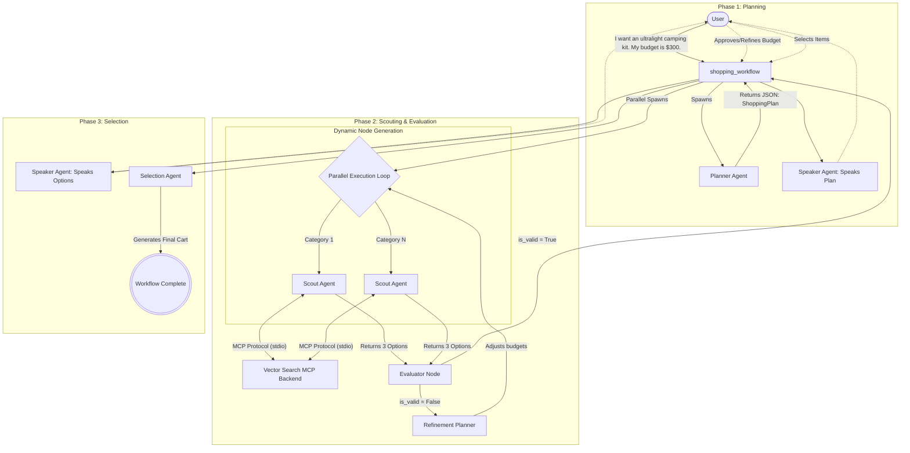

# Shopping Squad Architecture & UX Design

## Advanced UI / UX Patterns

The Shopping Squad implements several Advanced Development patterns to force the ADK UI to behave natively and cleanly.

### 1. The Speaker Agent pattern
Standard ADK workflows log string returns as "Trace Output" boxes and only draw "Chat Bubbles" when LLM Agents generate responses.
To fix this, `agent.py` uses a fast hidden `sys_speaker` `LlmAgent` instructed to blindly echo strings. The Orchestrator pipes HitL approval questions into this agent so that the UI correctly draws massive, readable grey Chat Bubbles when presenting data.

### 2. Mullet Prompting & `<json>` Extraction
By default, mapping LLM output strictly to Pydantic objects (`output_schema`) causes ADK to render the squished JSON output in the UI. 
Instead, the `scout.py` agents use **"Mullet Prompting"** (Business in the front, code in the back):
1. The Scout prints a highly conversational, pretty markdown message (bold fonts, green prices).
2. The Scout hides the absolute required JSON payload at the absolute bottom wrapped in an HTML Comment `<!--[JSON_PAYLOAD] ... [/JSON_PAYLOAD]-->`.
Since ADK renders Chat Bubbles via Markdown Engine, the HTML comment naturally vanishes from the screen, cleanly hiding the code from the user. `agent.py` then safely scrapes the XML using Regex before feeding the raw data to the Evaluator Node.

## State Management

- **Dynamic Node Names:** Dynamically generated nodes must have globally unique names per session turn. `agent.py` injects a UUID and loop index into each generated agent (`product_scout_node_XYZ_loop1_idx1`) to avoid unresolvable execution collisions.
- **`ctx.state` Loop Triggers:** The orchestrator implements a state machine utilizing `ctx.state.get("awaiting_approval")` and `ctx.state.get("awaiting_selection")` coupled with `@node(rerun_on_resume=True)` to natively pause workflows and await Human user text input without crashing.
